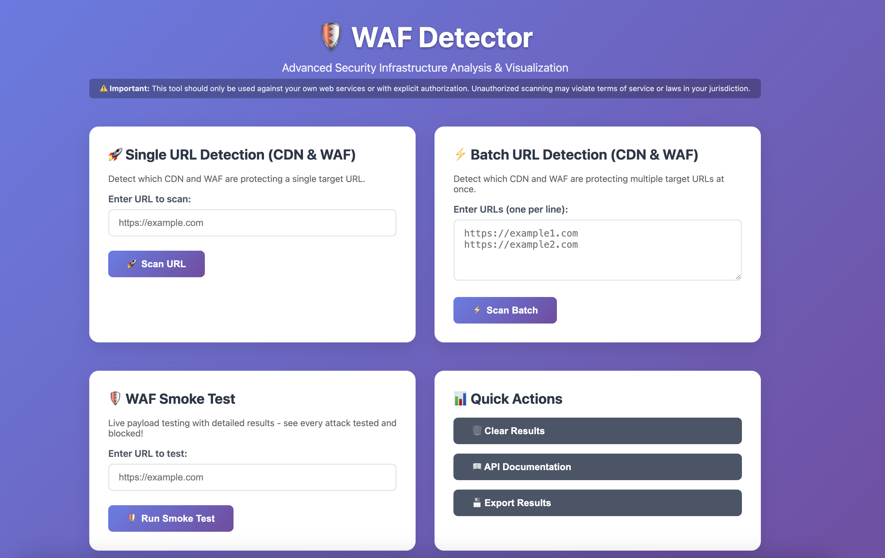

# WAF Detector



> Advanced Security Infrastructure Analysis & Visualization

## Features

- **Single URL Detection (CDN & WAF):** Detects which CDN and WAF are protecting a single target.
- **Batch URL Detection (CDN & WAF):** Scan multiple URLs at once for CDN and WAF detection.
- **WAF Smoke Test:** Live payload testing with detailed results.
- **Quick Actions:** Clear results, view API documentation, export results.

A high-performance tool for detecting and testing Web Application Firewalls (WAFs) and Content Delivery Networks (CDNs).

> ⚠️ **Important:** This tool should only be used against your own web services or with explicit authorization. Unauthorized scanning may violate terms of service or laws in your jurisdiction.

## 🚀 Quick Start

### Prerequisites
- Rust 1.70+ and Cargo (install from [rustup.rs](https://rustup.rs))

### Installation
```bash
# Clone the repository
git clone https://github.com/yourusername/waf-detector.git

# Navigate to the project directory
cd waf-detector

# Build the project
cargo build --release
```

### Basic Usage

**Scan a single URL:**
```bash
./target/release/waf-detect example.com
```

**Scan multiple URLs:**
```bash
./target/release/waf-detect example.com google.com cloudflare.com
```

**Batch scanning from file:**
```bash
# Create a file with URLs (one per line)
echo "https://cloudflare.com" > urls.txt
echo "https://example.com" >> urls.txt

./target/release/waf-detect @urls.txt
```

**Web interface (recommended for beginners):**
```bash
./target/release/waf-detect --web
# Then open http://localhost:8080 in your browser
```

## 🛡️ Features

- **WAF & CDN Detection**: Identifies protection systems with high accuracy
- **Multiple Providers**: CloudFlare, AWS WAF, Akamai, Fastly, Vercel
- **Security Testing**: Tests WAF effectiveness against common attacks
- **User-friendly Interface**: Web dashboard for easy visualization
- **Detailed Reports**: Evidence collection and confidence scoring

## 🧪 WAF Effectiveness Testing

Test how well a WAF blocks common attack patterns:

```bash
# Using the web interface (easiest method)
./target/release/waf-detect --web
# Then use the "WAF Smoke Test" option in the web interface

# Using the command line
./target/release/waf-detect --smoke-test example.com
```

### Attack Categories Tested

- SQL Injection
- Cross-Site Scripting (XSS)
- Command Injection
- Path Traversal
- Remote/Local File Inclusion
- Scanner Detection (Nikto, SQLmap, etc.)

## 📊 Output Options

```bash
# JSON output
./target/release/waf-detect example.com --json

# Pretty table format (default)
./target/release/waf-detect example.com

# Compact output
./target/release/waf-detect example.com --compact

# List available detection providers
./target/release/waf-detect --list
```

## 🔧 Advanced Options

```bash
# Custom port for web interface
./target/release/waf-detect --web --port 3000

# Aggressive testing mode
./target/release/waf-detect --smoke-test example.com --aggressive

# Custom headers for testing
./target/release/waf-detect --smoke-test example.com -H "Authorization: Bearer token"

# Export results to JSON
./target/release/waf-detect --smoke-test example.com -o results.json
```

## 📚 Help & Documentation

For complete documentation:

```bash
./target/release/waf-detect --help
```

When using the web interface, visit the API Documentation page for details on the REST API endpoints.

## 📄 License

MIT OR Apache-2.0

---

**Built with ❤️ using Rust** 🦀

## 🛠️ Getting Started as a New Developer

Follow these steps to contribute a new feature or test:

1. **Clone the repository:**
   ```sh
   git clone https://github.com/ammarion/waf-detector.git
   cd waf-detector
   ```

2. **Create a new feature branch:**
   ```sh
   git checkout -b feature/your-feature-name
   # or for a test:
   git checkout -b test/your-test-name
   ```

3. **Build the project:**
   ```sh
   cargo build --release
   ```

4. **Run the server:**
   ```sh
   ./start_server.sh
   # or for debug mode:
   ./debug_server.sh
   ```

5. **Test the UI:**
   - Open your browser to [http://localhost:8080](http://localhost:8080)
   - Try out the features as described above.

6. **Commit your changes:**
   ```sh
   git add .
   git commit -m "Add <your feature or test>"
   ```

7. **Push your branch and open a Pull Request:**
   ```sh
   git push origin feature/your-feature-name
   # Then open a PR on GitHub
   ```

8. **Get your code reviewed and merged!**

> **Note:** Direct commits to `main` are not allowed. Always use a feature or test branch and open a PR.