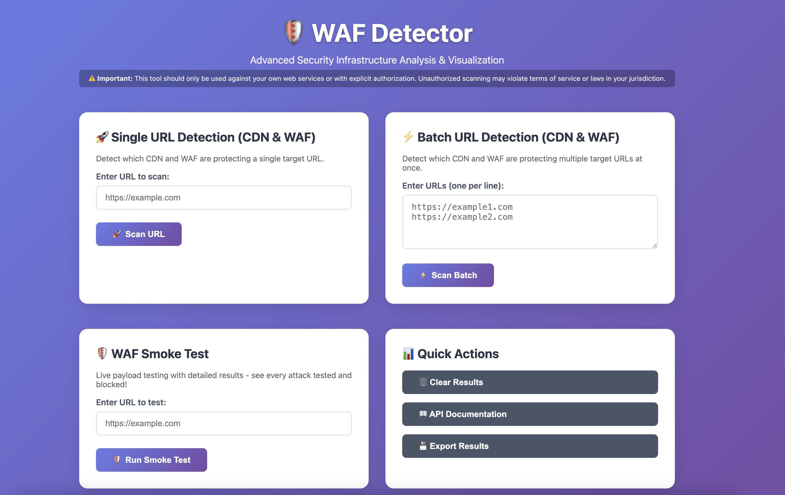

# WAF Detector



> Advanced Security Infrastructure Analysis & Visualization
> 
> **Dual Purpose Tool**: Detection + Effectiveness Testing for Web Application Firewalls

## Features

- **Single URL Detection (CDN & WAF):** Detects which CDN and WAF are protecting a single target.
- **Batch URL Detection (CDN & WAF):** Scan multiple URLs at once for CDN and WAF detection.
- **WAF Smoke Test:** Live payload testing with detailed results.
- **WAF Effectiveness Testing:** Comprehensive security validation with evasion techniques.
- **Quick Actions:** Clear results, view API documentation, export results.

A high-performance tool for detecting and testing Web Application Firewalls (WAFs) and Content Delivery Networks (CDNs).

> ⚠️ **Important:** This tool should only be used against your own web services or with explicit authorization. Unauthorized scanning may violate terms of service or laws in your jurisdiction.

## 🚀 Quick Start

### Prerequisites
- Rust 1.70+ and Cargo (install from [rustup.rs](https://rustup.rs))

### Installation
```bash
# Clone the repository
git clone https://github.com/ammarion/waf-detector.git

# Navigate to the project directory
cd waf-detector

# Build the project
cargo build --release
```

### Basic Usage

**Scan a single URL:**
```bash
./target/release/waf-detect example.com
```

**Scan multiple URLs:**
```bash
./target/release/waf-detect example.com google.com cloudflare.com
```

**Batch scanning from file:**
```bash
# Create a file with URLs (one per line)
echo "https://cloudflare.com" > urls.txt
echo "https://example.com" >> urls.txt

./target/release/waf-detect @urls.txt
```

**Web interface (recommended for beginners):**
```bash
./target/release/waf-detect --web
# Then open http://localhost:8080 in your browser
```

**Include payload-based analysis (optional but recommended for full detection coverage):**
```bash
./target/release/waf-detect example.com --payload-analysis
```

## 🛡️ Features

- **WAF & CDN Detection**: Identifies protection systems with high accuracy
- **Multiple Providers**: CloudFlare, AWS WAF, Akamai, Fastly, Vercel, Azure, F5 BIG-IP
- **Security Testing**: Tests WAF effectiveness against common attacks
- **User-friendly Interface**: Web dashboard for easy visualization
- **Detailed Reports**: Evidence collection and confidence scoring

## 🧪 WAF Effectiveness Testing

Test how well a WAF blocks common attack patterns:

```bash
# Using the web interface (easiest method)
./target/release/waf-detect --web
# Then use the "WAF Smoke Test" option in the web interface

# Using the command line
./target/release/waf-detect --smoke-test example.com
```

**Status meanings:**
- `BLOCKED`: Request was blocked by WAF or edge controls.
- `CHALLENGE`: Challenge or bot protection triggered (e.g., JavaScript/CAPTCHA).
- `ERROR`: Non-blocking failure (e.g., 404/500/timeout) that is not treated as a WAF block.

### Attack Categories Tested

- SQL Injection
- Cross-Site Scripting (XSS)
- Command Injection
- Path Traversal
- Remote/Local File Inclusion
- Scanner Detection (Nikto, SQLmap, etc.)

## 🔐 WAF Effectiveness Testing (Advanced)

Test your WAF's ability to block sophisticated attacks and evasion techniques with our comprehensive testing suite:

```bash
# First-time setup: provide consent and authorized targets
./target/release/waf-detect --consent request

# Run comprehensive effectiveness testing
./target/release/waf-detect --effectiveness example.com

# Check consent status and authorized targets
./target/release/waf-detect --consent

# Add additional authorized targets
./target/release/waf-detect --consent add-target newsite.com
```

### Effectiveness Testing Features

- **Multi-Phase Testing**: Baseline behavior analysis, detection capability testing, and advanced evasion techniques
- **Intensity Levels**: Configurable testing intensity (1-5) to match your security requirements
- **Attack Categories**: Tests SQL injection, XSS, command injection, XXE, SSRF, template injection, and more
- **Evasion Techniques**: Advanced bypass methods including case variation, Unicode encoding, HTTP parameter pollution
- **Risk Scoring**: Automated vulnerability assessment with 0-100 risk scores
- **Detailed Reporting**: Comprehensive HTML and JSON reports with remediation guidance
- **Rate Limiting**: Responsible testing with configurable request rates (default: 60/min)
- **Audit Trail**: All tests are logged with timestamps for compliance and forensics
- **Static Content Detection**: Warns if target appears to serve only static content

### Testing Phases Explained

**Phase 1: Baseline Testing**
- Establishes normal application behavior with benign requests
- Detects parameter processing capabilities
- Identifies baseline response patterns

**Phase 2: Detection Testing**
- Tests common attack patterns at configured intensity level
- Validates WAF blocking capabilities across multiple attack categories
- Records block rates and response patterns

**Phase 3: Advanced Evasion Testing** (Intensity 4+)
- Tests sophisticated bypass techniques
- Evaluates WAF resilience against advanced persistent threats
- Uses WAFFLED (Web Application Firewall Fuzzing and Low-level Evasion Detection) techniques

### Performance Characteristics

- **Request Rate**: Configurable (default 60 requests/minute)
- **Response Time**: Typical tests complete in 5-15 minutes
- **Request Delay**: 500ms between requests (configurable)
- **Timeout**: 30 seconds per request (configurable)
- **Memory Usage**: Minimal footprint with streaming results

### Consent Management System

The effectiveness testing module includes a robust consent management system:

- **Explicit Consent Required**: Users must acknowledge terms before first use
- **Authorized Target Lists**: Only pre-approved domains can be tested
- **Consent Expiration**: Consent expires after 30 days for security
- **Audit Logging**: All consent actions and test executions are logged
- **Terms Versioning**: System tracks consent to specific terms versions

⚠️ **Ethical Use Required**: Effectiveness testing includes advanced techniques that could bypass security controls. Only use on systems you own or have explicit permission to test. Unauthorized testing may violate laws and terms of service.

## 🧠 Virtual Adversary (Beta)

Virtual Adversary adds adaptive, consent-gated effectiveness testing with baseline-aware response analysis and strict request budgets.

```bash
# First-time setup: provide consent and authorized targets
./target/release/waf-detect --consent request

# Run Virtual Adversary testing
./target/release/waf-detect --va https://example.com
```

**Common options:**
- `--va-tier 1|2|3`: Safety tier for payload sophistication.
- `--va-budget N`: Max requests allowed per run.
- `--va-timeout SECONDS`: Per-request timeout in seconds.
- `--va-delay MS`: Delay between requests in milliseconds.
- `--va-variants N`: Variants per payload template.
- `--va-output report.json`: Save JSON report (also writes a `.summary.txt`).
- `--va-replay`: Print the replay plan JSON to stdout (probes, headers, and URLs).
- `--va-replay-csv`: Print the replay plan CSV to stdout.

**Replay plan exports (web UI):**
- VA history entries expose **Replay JSON** and **Replay CSV** downloads.
- Reports also include replay plan metadata in VA CSV exports.

> ⚠️ **Ethical Use Required:** Virtual Adversary simulates evasive attackers. Only use on systems you own or have explicit permission to test.

## 📊 Output Options

```bash
# JSON output
./target/release/waf-detect example.com --json

# Pretty table format (default)
./target/release/waf-detect example.com

# Compact output
./target/release/waf-detect example.com --compact

# List available detection providers
./target/release/waf-detect --list
```

## 🔧 Advanced Options

```bash
# Custom port for web interface
./target/release/waf-detect --web --port 3000

# Aggressive testing mode
./target/release/waf-detect --smoke-test example.com --aggressive

# Enable payload-based analysis (adds additional detection signals)
./target/release/waf-detect example.com --payload-analysis

# Custom headers for testing
./target/release/waf-detect --smoke-test example.com -H "Authorization: Bearer token"

# Export results to JSON
./target/release/waf-detect --smoke-test example.com -o results.json
```

## 📋 Usage Examples

### Complete Effectiveness Testing Workflow

```bash
# Step 1: Initial setup and consent
./target/release/waf-detect --consent request
# Follow prompts to acknowledge terms and add authorized targets

# Step 2: Basic WAF detection
./target/release/waf-detect example.com --json

# Step 3: Quick smoke test
./target/release/waf-detect --smoke-test example.com

# Step 4: Comprehensive effectiveness testing
./target/release/waf-detect --effectiveness example.com

# Step 5: Review and export results (results saved as HTML report)
```

### Consent Management Examples

```bash
# Check current consent status
./target/release/waf-detect --consent

# Request initial consent
./target/release/waf-detect --consent request

# Add new authorized target
./target/release/waf-detect --consent add-target api.example.com

# Re-consent after expiration (30 days)
./target/release/waf-detect --consent request
```

### Performance Tuning Examples

```bash
# Low intensity testing (safer for production)
# Note: Intensity is configured in effectiveness testing config (levels 1-5)
# Level 1-2: Basic patterns only
# Level 3: Standard attack patterns (default)
# Level 4: Advanced patterns + evasion techniques
# Level 5: Most aggressive testing

# The tool automatically adjusts based on detected WAF sensitivity
```

### Interpreting Results

**Risk Scores:**
- **0-25**: Low risk - WAF appears well-configured
- **25-50**: Medium risk - Some vulnerabilities detected
- **50-75**: High risk - Significant security gaps
- **75-100**: Critical risk - WAF may be misconfigured or bypassed

**Common Findings:**
- **High block rate (>90%)**: Well-configured WAF
- **Low block rate (<50%)**: WAF may be in detection-only mode
- **Identical responses**: Target may serve only static content
- **Timeout responses**: Rate limiting or performance issues

### Report Analysis

```bash
# Generate and view reports
./target/release/waf-detect --effectiveness example.com
# Creates: effectiveness_report_example.com_YYYY-MM-DD.html
# And: effectiveness_report_example.com_YYYY-MM-DD.json

# Key sections to review:
# 1. Risk Score: Overall security posture
# 2. Vulnerabilities: Specific attack vectors that succeeded
# 3. Recommendations: Actionable remediation steps
# 4. Statistics: Block rates and response times
```

## 📚 Help & Documentation

For complete documentation:

```bash
./target/release/waf-detect --help
```

When using the web interface, visit the API Documentation page for details on the REST API endpoints.

## 📄 License

MIT OR Apache-2.0

---

**Built with ❤️ using Rust** 🦀

## 🛠️ Getting Started as a New Developer

Follow these steps to contribute a new feature or test:

1. **Clone the repository:**
   ```sh
   git clone https://github.com/ammarion/waf-detector.git
   cd waf-detector
   ```

2. **Create a new feature branch:**
   ```sh
   git checkout -b feature/your-feature-name
   # or for a test:
   git checkout -b test/your-test-name
   ```

3. **Build the project:**
   ```sh
   cargo build --release
   ```

4. **Run the server:**
   ```sh
   ./start_server.sh
   # or for debug mode:
   ./debug_server.sh
   ```

5. **Test the UI:**
   - Open your browser to [http://localhost:8080](http://localhost:8080)
   - Try out the features as described above.

6. **Commit your changes:**
   ```sh
   git add .
   git commit -m "Add <your feature or test>"
   ```

7. **Push your branch and open a Pull Request:**
   ```sh
   git push origin feature/your-feature-name
   # Then open a PR on GitHub
   ```

8. **Get your code reviewed and merged!**

> **Note:** Direct commits to `main` are not allowed. Always use a feature or test branch and open a PR.
